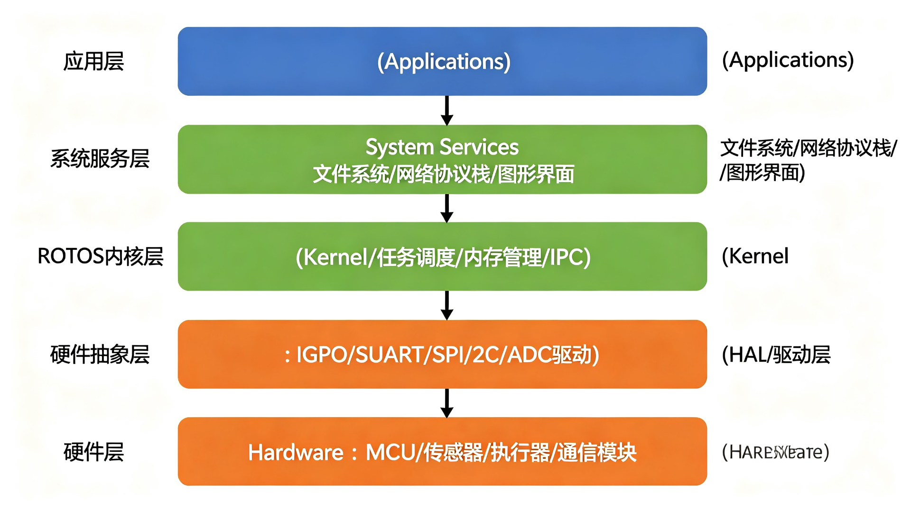
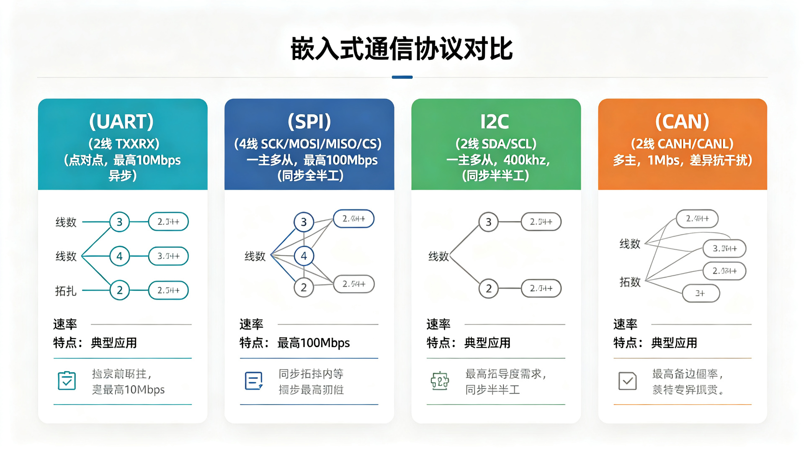
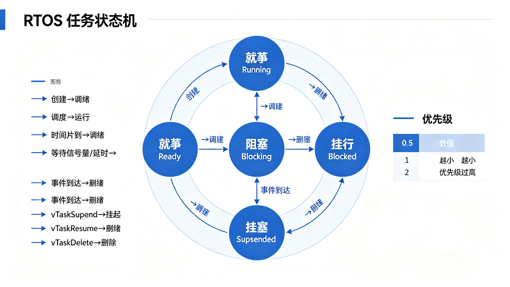

<div align="center">


# Embedded Skills 嵌入式开发技能集

</div>

一套面向嵌入式系统开发的 AI Agent Skills、示例项目和实用工具，覆盖从裸机开发到嵌入式 Linux 的完整技术栈。每个 Skill 包含原理说明、代码模板、调试技巧和常见问题排查，可直接用于 Doubao / 豆包等支持 Skill 的 AI 助手。

## 系统架构



## 技能列表（Skills）

| Skill | 描述 | 核心内容 |
|-------|------|----------|
| [embedded-stm32-dev](./embedded-stm32-dev) | STM32 微控制器开发 | CubeMX、HAL/LL 库、GPIO/UART/SPI/I2C/TIM/ADC/DMA、中断、低功耗、调试 |
| [embedded-arduino-dev](./embedded-arduino-dev) | Arduino / ESP32 开发 | Arduino IDE、PlatformIO、传感器驱动、WiFi/HTTP/MQTT、常用库 |
| [embedded-freertos](./embedded-freertos) | FreeRTOS 实时操作系统 | 任务管理、调度器、队列、信号量、互斥量、事件组、任务通知、软件定时器、内存管理 |
| [embedded-rt-thread](./embedded-rt-thread) | RT-Thread 实时操作系统 | 线程管理、IPC、设备驱动框架、FinSH、自动初始化、DFS、网络组件 |
| [embedded-zephyr](./embedded-zephyr) | Zephyr RTOS 开发 | West 构建、Devicetree、Kconfig、设备模型、Logging、Shell、蓝牙 BLE、网络 |
| [embedded-protocols](./embedded-protocols) | 嵌入式通信协议 | UART、SPI、I2C、CAN、1-Wire、RS-485、Modbus RTU/TCP、以太网/TCP-UDP、MQTT |
| [embedded-linux](./embedded-linux) | 嵌入式 Linux 开发 | 交叉编译、U-Boot、内核编译、设备树、Buildroot/Yocto、字符设备驱动、平台驱动、调试 |
| [embedded-debugging](./embedded-debugging) | 嵌入式调试技巧 | 串口调试、JTAG/SWD、GDB、HardFault 分析、栈溢出检测、内存泄漏、逻辑分析仪、功耗调试 |

## 技术图解

### 通信协议对比



### RTOS 任务状态机



## 示例项目（Examples）

| 项目 | 描述 |
|------|------|
| [stm32-blinky](./examples/stm32-blinky) | STM32F407 LED 闪烁 + 串口输出 + 按键外部中断 |
| [esp32-wifi-sensor](./examples/esp32-wifi-sensor) | ESP32 WiFi 温湿度传感器 + MQTT 上传 + OLED 显示 |
| [freertos-blinky](./examples/freertos-blinky) | FreeRTOS 多任务示例（队列/信号量/互斥量） |

详见 [examples/README.md](./examples/README.md)

## 实用工具（Tools）

| 工具 | 描述 |
|------|------|
| [serial_monitor.py](./tools/serial_monitor) | 串口监控工具（HEX/ASCII、时间戳、日志、自动重连） |
| [elf_analyzer.py](./tools/elf_analyzer) | ELF 固件分析工具（段信息、符号表、Flash/RAM 统计、未使用符号查找） |

详见 [tools/README.md](./tools/README.md)

## 安装使用

### 方式一：复制 Skill 到 AI 助手目录

将需要的 skill 文件夹复制到你的 AI 助手的 skills 目录下：

```bash
# 例如 Doubao / 豆包的 skills 目录
cp -r embedded-stm32-dev ~/.doubao/agent_mode/workspace/.skills/
```

### 方式二：作为参考文档

直接阅读每个 skill 下的 `SKILL.md`，作为嵌入式开发的速查手册和代码模板库。

### 方式三：使用示例和工具

```bash
# 运行串口监控工具
cd tools/serial_monitor
pip install pyserial
python serial_monitor.py --list

# 运行 ELF 分析工具
cd tools/elf_analyzer
pip install pyelftools
python elf_analyzer.py firmware.elf --all
```

## 目录结构

```
embedded-skills/
├── README.md
├── LICENSE
├── .gitignore
├── embedded-stm32-dev/        # STM32 开发
│   └── SKILL.md
├── embedded-arduino-dev/      # Arduino/ESP32 开发
│   └── SKILL.md
├── embedded-freertos/          # FreeRTOS
│   └── SKILL.md
├── embedded-rt-thread/         # RT-Thread
│   └── SKILL.md
├── embedded-zephyr/            # Zephyr RTOS
│   └── SKILL.md
├── embedded-protocols/         # 通信协议
│   └── SKILL.md
├── embedded-linux/             # 嵌入式 Linux
│   └── SKILL.md
├── embedded-debugging/         # 调试技巧
│   └── SKILL.md
├── examples/                    # 示例项目
│   ├── README.md
│   ├── stm32-blinky/
│   ├── esp32-wifi-sensor/
│   └── freertos-blinky/
└── tools/                       # 实用工具
    ├── README.md
    ├── serial_monitor/
    └── elf_analyzer/
```

## 适用平台

- **MCU**：STM32 F0/F1/F4/F7/H7/G0/G4/L4/L5/U5、Arduino AVR、ESP32/ESP8266
- **RTOS**：FreeRTOS、RT-Thread、Zephyr
- **Linux**：树莓派、全志 Allwinner、瑞芯微 Rockchip、NXP i.MX、TI AM335x 等 ARM 平台

## 贡献

欢迎提交 Issue 和 Pull Request 来补充更多嵌入式开发技能、示例项目或修正内容。

## License

MIT License
