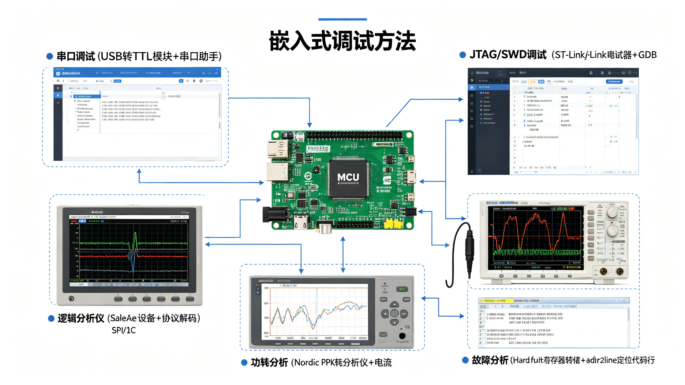

# 嵌入式系统调试指南

## 概述

嵌入式系统调试比纯软件调试更复杂，涉及硬件、固件、时序、电源等多维度问题。本 Skill 提供系统化的调试方法论、工具使用技巧和常见故障排查流程。

## 调试方法论

### 分层排查法

```
1. 物理层 → 电源、接线、电平、时钟
2. 驱动层 → 外设初始化、寄存器配置、中断
3. 系统层 → RTOS 调度、内存、栈
4. 应用层 → 业务逻辑、算法、状态机
5. 协议层 → 通信时序、数据格式、错误处理
```

### 二分法定位

- 将系统一分为二，确认问题在哪一半
- 用注释/条件编译隔离模块
- 用 LED/串口标记程序执行到哪一步

### 复现优先

- 先找到稳定复现条件（输入、时序、温度、电压）
- 不能复现的 bug 很难修，记录所有环境信息
- 偶发问题优先考虑：竞争条件、未初始化变量、栈溢出、中断优先级

## 串口调试

### printf 重定向（STM32）

```c
#include <stdio.h>

// 方法1：重定向 fputc（Keil 需勾选 Use MicroLIB）
int fputc(int ch, FILE *f) {
    HAL_UART_Transmit(&huart1, (uint8_t*)&ch, 1, 10);
    return ch;
}

// 方法2：重定向 _write（GCC/ARM Compiler 6）
int _write(int file, char *ptr, int len) {
    HAL_UART_Transmit(&huart1, (uint8_t*)ptr, len, 100);
    return len;
}

// 使用
printf("ADC value: %d, voltage: %.2fV\r\n", adc_val, voltage);
```

### 带级别和时间戳的日志宏

```c
#include <stdio.h>
#include "stm32f4xx_hal.h"

#define LOG_LEVEL_DEBUG  0
#define LOG_LEVEL_INFO   1
#define LOG_LEVEL_WARN   2
#define LOG_LEVEL_ERROR  3
#define LOG_LEVEL_NONE   4

#ifndef LOG_LEVEL
#define LOG_LEVEL LOG_LEVEL_DEBUG
#endif

#define LOG_COLOR
#ifdef LOG_COLOR
#define C_RESET  "\033[0m"
#define C_RED    "\033[31m"
#define C_YELLOW "\033[33m"
#define C_GREEN  "\033[32m"
#define C_CYAN   "\033[36m"
#else
#define C_RESET  ""
#define C_RED    ""
#define C_YELLOW ""
#define C_GREEN  ""
#define C_CYAN   ""
#endif

#define LOG_PRINT(level, color, fmt, ...) \
    do { \
        if (level >= LOG_LEVEL) { \
            printf("[%lu] " color "%s" C_RESET ": " fmt "\r\n", \
                   HAL_GetTick(), #level, ##__VA_ARGS__); \
        } \
    } while(0)

#define LOGD(fmt, ...) LOG_PRINT(DEBUG, C_CYAN, fmt, ##__VA_ARGS__)
#define LOGI(fmt, ...) LOG_PRINT(INFO, C_GREEN, fmt, ##__VA_ARGS__)
#define LOGW(fmt, ...) LOG_PRINT(WARN, C_YELLOW, fmt, ##__VA_ARGS__)
#define LOGE(fmt, ...) LOG_PRINT(ERROR, C_RED, fmt, ##__VA_ARGS__)

// 使用
LOGD("Initializing sensor...");
LOGI("Temperature: %.1f C", temp);
LOGW("Buffer almost full: %d/%d", used, size);
LOGE("I2C transaction failed: %d", status);
```

### 串口调试工具推荐

| 工具 | 平台 | 特点 |
|------|------|------|
| SSCOM | Windows | 国人常用，支持时间戳、HEX |
| MobaXterm | Windows | 全能终端，支持多标签 |
| Putty | 跨平台 | 轻量，支持串口/SSH |
| Tera Term | Windows | 支持宏脚本 |
| minicom/picocom | Linux | 命令行，轻量 |
| PlatformIO Serial Monitor | 跨平台 | 集成开发环境 |
| SerialPlot | 跨平台 | 实时绘图，适合传感器数据 |

### 串口数据绘图

```c
// 发送格式化数据，用 SerialPlot 绘图
// 格式：逗号分隔，换行结束
printf("%.2f,%.2f,%.2f\r\n", temp, humi, pressure);
```

## JTAG / SWD 在线调试

### 接口对比

| 接口 | 线数 | 速度 | 特点 |
|------|------|------|------|
| SWD | 2 (SWDIO/SWCLK) | 最高 ~50MHz | ARM 专用，省引脚，推荐 |
| JTAG | 4 (TDI/TDO/TMS/TCK) | 最高 ~20MHz | 标准，支持多设备链、边界扫描 |
| cJTAG | 2 | - | 精简 JTAG，新 ARM 核支持 |

### STM32 + ST-Link 调试（Keil）

1. 魔术棒 → Debug → 选择 ST-Link Debugger
2. Settings → Debug → 确认 SW 接口、端口号
3. Flash Download → 勾选 Reset and Run、对应 Flash 算法
4. Ctrl+F5 进入调试模式
5. 常用操作：
   - F5：运行（Run）
   - F10：单步跳过（Step Over）
   - F11：单步进入（Step Into）
   - Ctrl+F10：运行到光标（Run to Cursor）
   - Ctrl+B：断点管理
   - Watch 窗口：添加变量观察
   - Memory 窗口：查看内存（输入地址）
   - Peripherals 菜单：查看外设寄存器

### GDB 命令行调试（通用）

```bash
# 启动 GDB（交叉编译版）
arm-none-eabi-gdb firmware.elf

# 连接调试器（OpenOCD）
(gdb) target remote localhost:3333

# 加载固件
(gdb) load

# 断点
(gdb) break main              # 在 main 函数打断点
(gdb) break file.c:42         # 在指定行打断点
(gdb) break func if x > 10    # 条件断点
(gdb) watch variable           # 数据断点（变量变化时中断）
(gdb) info breakpoints        # 查看所有断点
(gdb) delete 1                 # 删除断点1
(gdb) disable 1                # 禁用断点1

# 运行控制
(gdb) continue                 # 继续运行（c）
(gdb) next                     # 单步跳过（n）
(gdb) step                     # 单步进入（s）
(gdb) finish                   # 运行到函数返回
(gdb) until 42                 # 运行到指定行
(gdb) interrupt                # 中断当前运行

# 查看数据
(gdb) print variable           # 打印变量（p）
(gdb) print/x variable         # 十六进制打印
(gdb) print array[0]@10        # 打印数组前10个元素
(gdb) info locals              # 查看所有局部变量
(gdb) info args                # 查看函数参数
(gdb) x/16x 0x20000000        # 查看内存（16个十六进制字）
(gdb) x/32xb &buffer           # 查看32字节
(gdb) display variable         # 每次停止自动显示

# 调用栈
(gdb) backtrace                # 查看调用栈（bt）
(gdb) frame 1                   # 切换到栈帧1
(gdb) info frame                # 查看当前栈帧详情

# 寄存器
(gdb) info registers            # 查看所有寄存器
(gdb) print $pc                 # 查看程序计数器
(gdb) print $sp                 # 查看栈指针
(gdb) set $pc = 0x08000000     # 修改PC（跳转执行）

# 高级
(gdb) define mycmd              # 自定义命令
> print var1
> print var2
> end
(gdb) mycmd
(gdb) save breakpoints brk.txt  # 保存断点
```

### OpenOCD 配置与使用

```bash
# 启动 OpenOCD（ST-Link + STM32F4）
openocd -f interface/stlink.cfg -f target/stm32f4x.cfg

# 常用 Telnet 命令（连接 localhost:4444）
> reset halt           # 复位并停止
> reset run            # 复位并运行
> flash write_image erase firmware.hex  # 烧录
> verify_image firmware.hex              # 校验
> mdw 0x20000000 16    # 读内存（32位）
> mww 0x20000000 0x12345678  # 写内存
> reg                  # 查看寄存器
> step                 # 单步
> resume               # 继续
> shutdown             # 退出
```

### 数据断点（Watchpoint）排查内存越界

```gdb
# 当某个变量被意外修改时中断
(gdb) watch global_var
(gdb) watch *(int*)0x20001234

# 读断点（仅被读时中断）
(gdb) rwatch buffer

# 读写断点
(gdb) awatch config_data
```

## HardFault 故障分析

### ARM Cortex-M Fault 类型

| Fault | 原因 |
|-------|------|
| HardFault | 其他 Fault 未处理，或优先级不足 |
| MemManage | MPU 违规、访问非法地址 |
| BusFault | 总线错误（访问不存在的外设、AHB错误） |
| UsageFault | 未定义指令、未对齐访问、除零、状态寄存器错误 |

### 自动保存故障现场

```c
// 在 stm32f4xx_it.c 的 HardFault_Handler 中
void HardFault_Handler(void) {
    // 方法1：printf 输出故障寄存器（需串口已初始化）
    printf("=== HardFault ===\r\n");
    printf("SCB->HFSR = 0x%08lX\r\n", SCB->HFSR);
    printf("SCB->CFSR = 0x%08lX\r\n", SCB->CFSR);
    printf("SCB->MMFAR = 0x%08lX\r\n", SCB->MMFAR);
    printf("SCB->BFAR = 0x%08lX\r\n", SCB->BFAR);
    printf("SCB->AFSR = 0x%08lX\r\n", SCB->AFSR);

    // 方法2：从栈中提取 CPU 寄存器
    // 进入异常时硬件自动保存 R0-R3, R12, LR, PC, xPSR
    __asm volatile(
        "tst lr, #4          \n"
        "ite eq               \n"
        "mrseq r0, msp        \n"
        "mrsne r0, psp        \n"
        "b hardfault_handler_c \n"
    );
}

void hardfault_handler_c(uint32_t *stack) {
    printf("R0  = 0x%08lX\r\n", stack[0]);
    printf("R1  = 0x%08lX\r\n", stack[1]);
    printf("R2  = 0x%08lX\r\n", stack[2]);
    printf("R3  = 0x%08lX\r\n", stack[3]);
    printf("R12 = 0x%08lX\r\n", stack[4]);
    printf("LR  = 0x%08lX\r\n", stack[5]);  // 函数返回地址
    printf("PC  = 0x%08lX\r\n", stack[6]);  // 故障发生地址！
    printf("xPSR= 0x%08lX\r\n", stack[7]);

    // 解析 CFSR 位
    uint32_t cfsr = SCB->CFSR;
    if (cfsr & (1 << 0))  printf("IACCVIOL: 指令访问违例\r\n");
    if (cfsr & (1 << 1))  printf("DACCVIOL: 数据访问违例\r\n");
    if (cfsr & (1 << 3))  printf("MUNSTKERR: 出栈错误\r\n");
    if (cfsr & (1 << 4))  printf("MSTKERR: 入栈错误\r\n");
    if (cfsr & (1 << 8))  printf("IBUSERR: 指令总线错误\r\n");
    if (cfsr & (1 << 9))  printf("PRECISERR: 精确数据总线错误\r\n");
    if (cfsr & (1 << 10)) printf("IMPRECISERR: 非精确总线错误\r\n");
    if (cfsr & (1 << 11)) printf("UNSTKERR: 出栈总线错误\r\n");
    if (cfsr & (1 << 12)) printf("STKERR: 入栈总线错误\r\n");
    if (cfsr & (1 << 16)) printf("UNDEFINSTR: 未定义指令\r\n");
    if (cfsr & (1 << 17)) printf("INVSTATE: 无效状态（Thumb位错误）\r\n");
    if (cfsr & (1 << 18)) printf("INVPC: 无效 PC 跳转\r\n");
    if (cfsr & (1 << 19)) printf("NOCP: 协处理器未启用\r\n");
    if (cfsr & (1 << 24)) printf("UNALIGNED: 未对齐访问\r\n");
    if (cfsr & (1 << 25)) printf("DIVBYZERO: 除零错误\r\n");

    while (1);  // 停机
}
```

### 用 addr2line 定位故障代码

```bash
# PC 或 LR 地址转换为代码位置
arm-none-eabi-addr2line -e firmware.elf -f -C -p 0x08001234
# 输出：function_name at src/main.c:42

# 批量解析调用栈
arm-none-eabi-addr2line -e firmware.elf -f -C -p 0x08001111 0x08002222 0x08003333
```

### 常见 HardFault 原因

| 原因 | 排查方法 |
|------|----------|
| 空指针解引用 | 检查 PC 地址，看是否在访问 NULL 附近 |
| 数组越界 | 检查故障地址是否在数组附近，用 watchpoint |
| 栈溢出 | 检查 SP 是否超出栈范围，增大栈 |
| 中断优先级错误 | 检查 FreeRTOS 中断优先级配置 |
| 未初始化函数指针 | 检查函数指针是否为 0xFFFFFFFF 或随机值 |
| 访问已卸载外设 | 检查外设时钟是否使能、地址是否正确 |
| 浮点指令未启用 | 启用 CP10/CP11（SCB->CPACR） |
| 错误的中断向量 | 检查启动文件向量表、中断处理函数名 |

## 栈溢出检测

### 方法1：水位线检测（Watermark）

```c
// 任务创建时填充已知模式
void fill_stack_pattern(StackType_t *stack, size_t size) {
    for (size_t i = 0; i < size; i++) {
        stack[i] = 0xA5A5A5A5;  // 已知模式
    }
}

// 运行时检查剩余栈
size_t check_stack_remaining(StackType_t *stack, size_t size) {
    size_t used = 0;
    for (size_t i = 0; i < size; i++) {
        if (stack[i] != 0xA5A5A5A5) {
            used = size - i;
            break;
        }
    }
    return size - used;  // 剩余
}

// FreeRTOS 内置
UBaseType_t remaining = uxTaskGetStackHighWaterMark(taskHandle);
// 返回剩余栈的最小值（历史水位线）
```

### 方法2：MPU 栈保护（ARMv7-M+）

```c
// 配置 MPU，在栈底部设置不可访问区域
// 栈溢出时触发 MemManage Fault 而非静默破坏内存
void configure_mpu_stack_guard(uint32_t stack_bottom) {
    MPU->RNR = 0;  // 区域0
    MPU->RBAR = stack_bottom & ~0x1F;  // 32字节对齐
    MPU->RASR = (0b000 << 24)   // 禁止访问
               | (0b011 << 1)    // 8字节大小（示例，实际按需）
               | (1 << 0);       // 使能
    MPU->CTRL = MPU_CTRL_ENABLE_Msk | MPU_CTRL_PRIVDEFENA_Msk;
    __DSB();
    __ISB();
}
```

### 方法3：编译器栈检查

```c
// GCC 启用栈检查
// CFLAGS += -fstack-usage -fconserve-stack
// 编译后生成 .su 文件，显示每个函数的栈使用

// 运行时栈溢出检测（GCC libssp）
// CFLAGS += -fstack-protector-strong
// 需要实现 __stack_chk_fail
void __stack_chk_fail(void) {
    printf("Stack overflow detected!\r\n");
    while (1);
}
```

## 内存泄漏排查

### 方法1：内存分配跟踪

```c
// 包装 malloc/free，记录分配信息
#define DEBUG_MALLOC
#ifdef DEBUG_MALLOC
#define malloc(size) debug_malloc(size, __FILE__, __LINE__)
#define free(ptr)    debug_free(ptr, __FILE__, __LINE__)
#endif

typedef struct {
    void *ptr;
    size_t size;
    const char *file;
    int line;
} alloc_record_t;

#define MAX_RECORDS 256
static alloc_record_t records[MAX_RECORDS];
static int record_count = 0;

void *debug_malloc(size_t size, const char *file, int line) {
    void *ptr = pvPortMalloc(size);  // 或 malloc
    if (ptr && record_count < MAX_RECORDS) {
        records[record_count++] = (alloc_record_t){ptr, size, file, line};
    }
    return ptr;
}

void debug_free(void *ptr, const char *file, int line) {
    for (int i = 0; i < record_count; i++) {
        if (records[i].ptr == ptr) {
            // 移除记录
            for (int j = i; j < record_count - 1; j++) {
                records[j] = records[j + 1];
            }
            record_count--;
            break;
        }
    }
    vPortFree(ptr);
}

// 打印未释放的内存（泄漏）
void print_memory_leaks(void) {
    printf("=== Memory Leaks: %d records ===\r\n", record_count);
    for (int i = 0; i < record_count; i++) {
        printf("  %p: %u bytes at %s:%d\r\n",
               records[i].ptr, records[i].size,
               records[i].file, records[i].line);
    }
}
```

### 方法2：FreeRTOS 堆监控

```c
// 定期打印堆使用情况
void heap_monitor_task(void *pv) {
    while (1) {
        size_t free_size = xPortGetFreeHeapSize();
        size_t min_free = xPortGetMinimumEverFreeHeapSize();
        printf("Heap: free=%u, min_ever_free=%u, used_peak=%u\r\n",
               free_size, min_free, configTOTAL_HEAP_SIZE - min_free);
        vTaskDelay(pdMS_TO_TICKS(5000));
    }
}
```

## 逻辑分析仪使用

### 选型

| 设备 | 通道数 | 最大采样率 | 特点 |
|------|--------|-----------|------|
| Saleae Logic 8 | 8 | 100MHz | 工业标准，软件好用 |
| DSLogic Plus | 16 | 100MHz | 国产，性价比高 |
| 便宜 USB 逻辑分析仪（fx2lfx） | 8 | 24MHz | 极便宜，支持 sigrok/PulseView |
| 示波器自带逻辑 | 8-16 | 取决于示波器 | 模拟+数字混合 |

### 常用协议解码

```
UART: 设置波特率、数据位、停止位、校验位、极性
SPI:  设置 CPOL/CPHA、位序（MSB/LSB）、片选极性
I2C:  无需额外设置，自动识别起始/停止/ACK
CAN:  设置波特率、采样点
1-Wire: 设置速率（标准/ overdrive）
SWD:  设置时钟频率
JTAG: 设置 TCK 频率
```

### 调试技巧

1. **触发设置**：用特定模式触发（如 I2C 起始、SPI 片选拉低、UART 特定字节）
2. **通道分组**：相关信号放一起（SPI 的 SCK/MOSI/MISO/CS）
3. **采样率**：至少是信号速率的 10 倍，I2C 400kHz 用 4MHz+
4. **存储深度**：长记录用低采样率，短脉冲用高采样率
5. **对比正常/异常**：先抓正常工作的波形作为参考

## 示波器使用要点

### 探头设置

- **1x vs 10x**：10x 衰减，输入阻抗高（10MΩ），负载小，推荐默认用 10x
- **补偿调节**：用方波信号校准探头，避免过冲/欠冲
- **接地弹簧**：高频信号用接地弹簧代替鳄鱼夹，减小地环路

### 测量参数

```
频率、周期、占空比
上升时间、下降时间
峰峰值、最大值、最小值、平均值
过冲、预冲
建立时间、保持时间
相位差（双通道）
```

### 电源完整性测量

```c
// 测量电源纹波
// 1. 示波器 AC 耦合
// 2. 带宽限制（20MHz）滤除高频噪声
// 3. 探头接地弹簧靠近测量点
// 4. 测量峰峰值（通常要求 < 3% 额定电压）
// 3.3V 电源纹波应 < 100mV
```

## 功耗调试

### 测量方法

| 方法 | 精度 | 特点 |
|------|------|------|
| 万用表串联 | mA 级 | 简单，只能测平均电流 |
| 电流探头（示波器） | mA 级 | 可测动态电流、波形 |
| 专用功耗分析仪（Nordic PPK/Qorvo） | uA 级 | 高精度，实时绘图，适合低功耗 |
| 采样电阻 + 示波器 | uA 级 | 自制，需注意电阻压降 |

### 低功耗调试要点

```c
// 1. 测量各模式电流
//    运行 / Sleep / Stop / Standby / Shutdown

// 2. 关闭未用外设时钟
__HAL_RCC_GPIOA_CLK_DISABLE();
// 或在 CubeMX 中不启用

// 3. GPIO 状态配置（未用引脚设为模拟输入，降低功耗）
GPIO_InitStruct.Mode = GPIO_MODE_ANALOG;
GPIO_InitStruct.Pull = GPIO_NOPULL;

// 4. 降低系统时钟
// 低功耗模式前切换到 HSI 或更低频率

// 5. 进入低功耗前的检查
//    - 所有 DMA 已停止
//    - 所有中断已配置唤醒源
//    - 闪存已设置为低功耗模式
//    - 电压调节器已设置为低功耗模式
```

## 实时性分析

### 中断延迟测量

```c
// 用 GPIO 翻转 + 示波器测量
// 中断触发时翻转 GPIO，测量从信号到 GPIO 翻转的时间
void EXTI0_IRQHandler(void) {
    HAL_GPIO_TogglePin(GPIOA, GPIO_PIN_0);  // 标记中断开始
    // ... 处理 ...
    HAL_GPIO_TogglePin(GPIOA, GPIO_PIN_0);  // 标记中断结束
    HAL_GPIO_EXTI_IRQHandler(GPIO_PIN_0);
}
```

### 任务执行时间测量

```c
// 方法1：GPIO + 示波器
void task_entry(void *p) {
    while (1) {
        HAL_GPIO_WritePin(GPIOA, GPIO_PIN_1, GPIO_PIN_SET);
        do_work();
        HAL_GPIO_WritePin(GPIOA, GPIO_PIN_1, GPIO_PIN_RESET);
        vTaskDelay(100);
    }
}

// 方法2：时间戳
uint32_t start = HAL_GetTick();
do_work();
uint32_t elapsed = HAL_GetTick() - start;
printf("do_work took %lu ms\r\n", elapsed);

// 方法3：DWT 周期计数器（微秒级精度）
uint32_t start_cycles = DWT->CYCCNT;
do_work();
uint32_t elapsed_cycles = DWT->CYCCNT - start_cycles;
float elapsed_us = elapsed_cycles / (SystemCoreClock / 1000000.0f);
```

### FreeRTOS 运行时间统计

```c
// FreeRTOSConfig.h 启用
#define configGENERATE_RUN_TIME_STATS           1
#define configUSE_STATS_FORMATTING_FUNCTIONS    1
#define portCONFIGURE_TIMER_FOR_RUN_TIME_STATS()  configure_timer()
#define portGET_RUN_TIME_COUNTER_VALUE()          get_timer_count()

// 实现一个高速定时器（比 SysTick 快 10-100 倍）

// 查看统计
char buf[1024];
vTaskGetRunTimeStats(buf);
printf("%s\r\n", buf);
// 输出每个任务的运行时间和百分比
```

## 断言（Assert）

```c
// STM32 HAL 内置断言
void assert_failed(uint8_t *file, uint32_t line) {
    printf("Assertion failed at %s:%lu\r\n", file, line);
    while (1);  // 停机
}
// 使用
assert_param(IS_GPIO_PIN(pin));

// 自定义断言宏
#define ASSERT(cond) \
    do { \
        if (!(cond)) { \
            printf("ASSERT FAILED: %s at %s:%d\r\n", #cond, __FILE__, __LINE__); \
            while (1); \
        } \
    } while(0)

// 使用
ASSERT(ptr != NULL);
ASSERT(index < array_size);
ASSERT(x > 0 && x < 100);
```

## 常见 Bug 模式

### 未初始化变量

```c
// 危险：局部变量未初始化
int calculate(void) {
    int result;  // 未初始化，值随机
    if (condition) {
        result = 10;
    }
    return result;  // condition 为假时返回随机值！
}

// 修复：初始化
int result = 0;
```

### 竞态条件（Race Condition）

```c
// 危险：主循环和中断同时访问共享变量
volatile int counter = 0;

void ISR(void) {
    counter++;  // 读-改-写，非原子操作
}

void main_loop(void) {
    if (counter > 100) {  // 可能被中断打断
        counter = 0;
    }
}

// 修复：临界区保护
void main_loop(void) {
    __disable_irq();
    int temp = counter;
    if (temp > 100) counter = 0;
    __enable_irq();
}
// 或使用原子操作、消息队列
```

### 整数溢出

```c
// 危险：16位变量溢出
uint16_t sum = 0;
for (int i = 0; i < 1000; i++) {
    sum += 50;  // 1000 * 50 = 50000，超过 65535？不，50000 < 65535
}
// 但 2000 * 50 = 100000 > 65535，溢出！

// 修复：用足够大的类型
uint32_t sum = 0;
```

### 缓冲区溢出

```c
// 危险：sprintf 不检查长度
char buf[16];
sprintf(buf, "Temperature: %.2f", temp);  // 可能超过 16 字节！

// 修复：用 snprintf
snprintf(buf, sizeof(buf), "Temperature: %.2f", temp);
```

### 死循环阻塞

```c
// 危险：在主循环中忙等
void wait_for_button(void) {
    while (HAL_GPIO_ReadPin(BTN_PORT, BTN_PIN) == GPIO_PIN_SET) {
        // 空循环，CPU 被占满，其他任务无法运行
    }
}

// 修复：用非阻塞状态机或 RTOS 延时
// 或用中断+信号量
```

### 浮点比较

```c
// 危险：直接比较浮点数
float a = 0.1 + 0.2;
if (a == 0.3) {  // 可能不成立！0.1+0.2 = 0.30000000000000004
    // ...
}

// 修复：epsilon 比较
#define EPSILON 0.0001f
if (fabsf(a - 0.3f) < EPSILON) {
    // ...
}
```

## 调试检查清单

### 上电前
- [ ] 电源电压正确（3.3V/5V），极性正确
- [ ] 复位电路正常（NRST 上拉）
- [ ] 晶振起振（用示波器测）
- [ ] SWD/JTAG 接线正确
- [ ] BOOT 引脚配置正确（从 Flash 启动）

### 固件下载
- [ ] 芯片型号选择正确
- [ ] Flash 算法匹配
- [ ] 烧录成功校验
- [ ] 复位后运行

### 基本功能
- [ ] LED 闪烁（确认系统时钟和主循环运行）
- [ ] 串口输出（确认 printf 重定向）
- [ ] 定时器中断（确认中断系统）
- [ ] 外设初始化无错误返回

### 稳定性
- [ ] 长时间运行无崩溃（24小时+）
- [ ] 高低温测试
- [ ] 电源波动测试
- [ ] 频繁复位测试
- [ ] 看门狗正常工作

## 参考资源

- [ARM Cortex-M Fault 处理](https://www.keil.com/appnotes/files/apnt209.pdf)
- [OpenOCD 文档](https://openocd.org/doc/html/index.html)
- [GDB 手册](https://sourceware.org/gdb/current/onlinedocs/gdb/)
- [Saleae 逻辑分析仪使用](https://support.saleae.com/)
- [Segger J-Link 文档](https://www.segger.com/products/debug-probes/j-link/)
