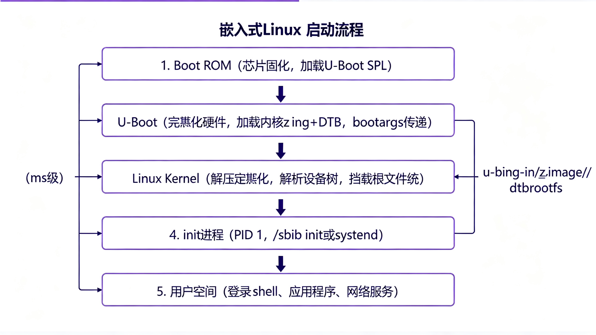

# 嵌入式 Linux 开发指南

## 概述

本 Skill 面向嵌入式 Linux 系统开发，覆盖从工具链到应用层的完整流程：交叉编译 → Bootloader（U-Boot）→ Linux 内核 → 设备树 → 根文件系统 → 驱动开发 → 应用调试。适用于树莓派、全志（Allwinner）、瑞芯微（Rockchip）、NXP i.MX、TI AM335x 等常见 ARM 平台。

## 核心规则

- **交叉编译**：所有在目标板运行的代码必须用对应架构的交叉编译器编译，不能用主机 gcc。
- **设备树是硬件描述**：新增硬件必须修改设备树（.dts/.dtsi），不要在驱动代码中硬编码引脚和地址。
- **内核版本匹配**：驱动开发必须针对目标板运行的内核版本，头文件必须来自该版本内核源码。
- **根文件系统只读保护**：嵌入式设备根文件系统建议挂载为只读（ro），需要写入的目录用 tmpfs 或单独分区。
- **不要在驱动中用 printf**：内核空间用 `printk()`，指定日志级别（`KERN_INFO`、`KERN_ERR` 等）。
- **先确认工具链和源码版本**：动手前先 `arm-linux-gnueabihf-gcc --version` 和 `uname -r`，确认版本匹配。

## 嵌入式 Linux 系统组成

```
┌─────────────────────────────────────┐
│         应用层 (Applications)        │  ← 用户程序、Qt、Web 服务器
├─────────────────────────────────────┤
│         C 库 / 系统库 (glibc/musl)  │
├─────────────────────────────────────┤
│         Linux 内核 (Kernel)          │  ← 进程调度、内存管理、驱动
├─────────────────────────────────────┤
│         设备树 (Device Tree Blob)    │  ← 硬件描述
├─────────────────────────────────────┤
│         Bootloader (U-Boot)          │  ← 初始化硬件、加载内核
├─────────────────────────────────────┤
│         ROM / 片内 Boot ROM          │  ← 芯片出厂固化
└─────────────────────────────────────┘
```

## 启动流程

```
1. 上电 → 芯片 Boot ROM 运行（从 SD/eMMC/NAND/Flash 加载 U-Boot SPL）
2. SPL（Secondary Program Loader）→ 初始化 DDR，加载完整 U-Boot
3. U-Boot → 初始化串口/网络/存储，加载内核 zImage + DTB 到内存
4. U-Boot → bootm/bootz 启动内核，传递 DTB 地址和 bootargs
5. 内核 → 解压、初始化硬件（根据 DTB）、挂载根文件系统
6. 内核 → 启动 init 进程（PID 1），执行 /sbin/init 或 /linuxrc
7. init → 读取 /etc/inittab 或 systemd 单元，启动用户空间服务
```

---

## 交叉编译工具链

### 工具链命名规则

```
arch-vendor-os-abi
例如：arm-linux-gnueabihf-gcc
- arch: arm / aarch64 / mips / riscv64
- vendor: 厂商（通常可省略或为 unknown/buildroot）
- os: linux
- abi: gnueabi / gnueabihf (硬浮点) / muslgnueabi
```

### 常见工具链

| 工具链 | 架构 | 浮点 | C库 | 用途 |
|--------|------|------|-----|------|
| arm-linux-gnueabihf- | ARM 32位 | 硬浮点 | glibc | 通用 ARMv7 |
| aarch64-linux-gnu- | ARM 64位 | - | glibc | ARM64 |
| arm-buildroot-linux-gnueabihf- | ARM 32位 | 硬浮点 | buildroot 定制 | Buildroot 生成 |
| arm-none-eabi- | ARM 32位 | - | 无（裸机） | 裸机/RTOS |

### 安装（Ubuntu/Debian）

```bash
# ARM 32位（硬浮点）
sudo apt install gcc-arm-linux-gnueabihf g++-arm-linux-gnueabihf

# ARM 64位
sudo apt install gcc-aarch64-linux-gnu g++-aarch64-linux-gnu

# 验证
arm-linux-gnueabihf-gcc --version
```

### 编译简单程序

```bash
# 编译
arm-linux-gnueabihf-gcc -o hello hello.c -static

# 查看文件类型（确认是 ARM 架构）
file hello
# 输出：hello: ELF 32-bit LSB executable, ARM, EABI5 version 1 ...

# 静态编译（不依赖目标板 C 库，推荐用于测试）
arm-linux-gnueabihf-gcc -static -o hello hello.c

# 动态编译（体积小，但目标板需有对应 glibc）
arm-linux-gnueabihf-gcc -o hello hello.c
```

### Makefile 交叉编译模板

```makefile
CROSS_COMPILE ?= arm-linux-gnueabihf-
CC = $(CROSS_COMPILE)gcc
CXX = $(CROSS_COMPILE)g++
CFLAGS = -Wall -O2 -static

TARGET = app
SRCS = main.c utils.c

all: $(TARGET)

$(TARGET): $(SRCS)
	$(CC) $(CFLAGS) -o $@ $^

clean:
	rm -f $(TARGET)

# 使用：make CROSS_COMPILE=aarch64-linux-gnu-
```

---

## U-Boot

### 编译 U-Boot

```bash
# 下载源码
git clone https://gitlab.denx.de/u-boot/u-boot.git
cd u-boot
git checkout v2024.01  # 选择稳定版本

# 配置（以树莓派 3 为例，其他板卡找对应 defconfig）
make CROSS_COMPILE=aarch64-linux-gnu- rpi_3_defconfig

# 或图形化配置
make CROSS_COMPILE=aarch64-linux-gnu- menuconfig

# 编译
make CROSS_COMPILE=aarch64-linux-gnu- -j$(nproc)

# 产物：u-boot.bin（二进制）、u-boot.img（带头部）、u-boot.elf
```

### 常用 U-Boot 命令

```bash
# 信息查看
printenv                    # 查看所有环境变量
bdinfo                      # 查看板卡信息
version                     # U-Boot 版本

# 内存操作
md 0x80000000 10           # 显示内存（16进制，10个32位字）
mm 0x80000000              # 修改内存（交互式）
mw 0x80000000 0xAA 100     # 写内存（填充0xAA，100个字）
cp 0x80000000 0x80100000 0x1000  # 内存拷贝

# 存储操作
mmc dev 0                   # 选择 SD 卡（设备0）
mmc part                    # 查看分区
mmc read 0x80000000 0x800 0x100  # 读 SD 卡到内存（扇区号0x800，0x100扇区）
mmc write 0x80000000 0x800 0x100  # 写内存到 SD 卡

sf probe 0                  # 探测 SPI Flash
sf read 0x80000000 0x0 0x100000  # 读 SPI Flash

# 网络操作
setenv ipaddr 192.168.1.100
setenv serverip 192.168.1.10
setenv gatewayip 192.168.1.1
ping 192.168.1.10
tftp 0x80000000 zImage     # 通过 TFTP 下载内核
nfs 0x80000000 192.168.1.10:/nfs/rootfs  # NFS 挂载

# 启动
bootz 0x80000000 - 0x83000000  # 启动 zImage（内核地址 -  ramdisk  DTB地址）
bootm 0x80000000                 # 启动 uImage
boot                              # 按 bootcmd 自动启动

# 环境变量保存
saveenv                       # 保存环境变量到存储
setenv bootargs 'console=ttyS0,115200 root=/dev/mmcblk0p2 rw rootwait'
editenv bootcmd               # 编辑启动命令
```

### 典型 bootargs

```bash
# SD 卡根文件系统
console=ttyS0,115200 root=/dev/mmcblk0p2 rw rootwait earlyprintk

# NFS 根文件系统（开发调试用）
console=ttyS0,115200 root=/dev/nfs nfsroot=192.168.1.10:/nfs/rootfs,v3,tcp ip=192.168.1.100::192.168.1.1:255.255.255.0::eth0:off

# initramfs
console=ttyS0,115200 root=/dev/ram0 rw initrd=0x83000000,64M

# 只读根文件系统（产品化）
console=ttyS0,115200 root=/dev/mmcblk0p2 ro rootwait
```

---

## Linux 内核

### 获取内核源码

```bash
# 主线内核
git clone https://git.kernel.org/pub/scm/linux/kernel/git/stable/linux.git
cd linux
git checkout v6.6.0  # LTS 版本

# 或厂商内核（树莓派）
git clone --depth=1 -b rpi-6.6.y https://github.com/raspberrypi/linux.git
```

### 配置与编译

```bash
# 导出架构和交叉编译器
export ARCH=arm
export CROSS_COMPILE=arm-linux-gnueabihf-

# 使用默认配置
make bcm2709_defconfig  # 树莓派 2/3 32位
# 或 make multi_v7_defconfig（通用 ARMv7）

# 图形化配置（按需修改）
make menuconfig
# 常用选项：
#   Device Drivers → 启用需要的驱动
#   File systems → 启用需要的文件系统
#   Kernel Features → 预取、SMP 等

# 编译内核（zImage 或 Image）
make -j$(nproc) zImage    # ARM 32位压缩内核
make -j$(nproc) Image      # ARM64 未压缩内核

# 编译设备树
make -j$(nproc) dtbs

# 编译模块
make -j$(nproc) modules

# 安装模块到指定目录
make modules_install INSTALL_MOD_PATH=../rootfs
```

### 内核产物

```
arch/arm/boot/zImage       ← 压缩内核镜像（U-Boot 用 bootz 启动）
arch/arm/boot/Image        ← 未压缩内核
arch/arm/boot/dts/*.dtb    ← 编译后的设备树二进制
vmlinux                     ← 带符号的 ELF 内核（调试用）
System.map                  ← 内核符号地址表
```

### 内核版本与配置查看

```bash
# 目标板上查看
uname -a                    # 内核版本、架构、编译时间
uname -r                    # 内核版本号
cat /proc/version           # 详细版本信息
zcat /proc/config.gz        # 查看编译配置（需 CONFIG_IK_CONFIG）
ls /lib/modules/$(uname -r)/  # 已安装模块
```

---

## 设备树（Device Tree）

### 原理

设备树是一种描述硬件的数据结构，将硬件信息从内核代码中分离出来。内核启动时解析 DTB，根据描述初始化对应设备和驱动。

### 文件类型

| 文件 | 说明 |
|------|------|
| `.dts` | 设备树源文件（板级描述，如 bcm2710-rpi-3-b.dts） |
| `.dtsi` | 设备树包含文件（通用描述，被 .dts 引用） |
| `.dtb` | 编译后的二进制设备树（U-Boot 传给内核） |
| `.dts` 编译 | `dtc -I dts -O dtb board.dts -o board.dtb` |

### 基本语法

```dts
/dts-v1/;
#include "bcm2837.dtsi"  // 包含通用描述

/ {
    model = "Raspberry Pi 3 Model B";
    compatible = "raspberrypi,3-model-b", "brcm,bcm2837";

    // 地址映射
    memory@0 {
        device_type = "memory";
        reg = <0 0x40000000>;  // 起始地址 0，大小 1GB
    };

    // 选择的内核
    chosen {
        bootargs = "console=ttyS0,115200 root=/dev/mmcblk0p2 rw rootwait";
        stdout-path = &uart0;
    };

    // 自定义 LED
    leds {
        compatible = "gpio-leds";
        act_led: led@0 {
            label = "ACT";
            gpios = <&gpio 47 GPIO_ACTIVE_HIGH>;
            linux,default-trigger = "mmc0";
        };
    };

    // 自定义按键
    keys {
        compatible = "gpio-keys";
        button@0 {
            label = "BTN1";
            linux,code = <KEY_ENTER>;
            gpios = <&gpio 17 GPIO_ACTIVE_LOW>;
        };
    };
};

// 引用已有节点并修改（& 符号）
&uart0 {
    status = "okay";  // 启用
};

&i2c1 {
    status = "okay";
    clock-frequency = <400000>;

    // 挂载 I2C 设备
    bme280@76 {
        compatible = "bosch,bme280";
        reg = <0x76>;
    };
};

&spi0 {
    status = "okay";
    spidev@0 {
        compatible = "spidev";
        reg = <0>;
        spi-max-frequency = <10000000>;
    };
};
```

### 设备树编译与反编译

```bash
# 编译 dts → dtb
dtc -I dts -O dtb -o board.dtb board.dts

# 反编译 dtb → dts（查看目标板设备树）
dtc -I dtb -O dts -o board.dts /boot/bcm2710-rpi-3-b.dtb

# 内核中编译
make ARCH=arm CROSS_COMPILE=arm-linux-gnueabihf- dtbs
```

### 运行时查看设备树

```bash
# 目标板上查看设备树
ls /proc/device-tree/                    # 根节点
cat /proc/device-tree/model               # 板卡型号
ls /proc/device-tree/leds/                # LED 节点
cat /proc/device-tree/leds/led@0/label   # LED 标签
ls /proc/device-tree/soc/                  # SoC 节点
find /proc/device-tree -name "status" -exec cat {} \; -print  # 查看所有 status

# 查看设备树解析后的设备
ls /sys/firmware/devicetree/base/
```

### 设备树调试

```bash
# 内核启动日志中查看设备树解析
dmesg | grep -i "device tree"
dmesg | grep -i "of:"
dmesg | grep -i "failed to find"

# 查看驱动是否匹配设备
ls /sys/bus/platform/devices/
ls /sys/bus/i2c/devices/
ls /sys/bus/spi/devices/
```

---

## 根文件系统

### Buildroot（简单快速）

```bash
# 下载
git clone https://gitlab.com/buildroot.org/buildroot.git
cd buildroot
git checkout 2024.02

# 配置
make raspberrypi3_defconfig  # 树莓派 3 默认配置
make menuconfig               # 自定义
# Target options → 架构、浮点
# Toolchain → 工具链配置（glibc/musl、内核头版本）
# System configuration → 主机名、密码、init 系统
# Target packages → 选择需要的软件包
# Filesystem images → 根文件系统格式（ext4/squashfs/tar）

# 编译（首次较慢，会下载所有源码）
make -j$(nproc)

# 产物
output/images/rootfs.ext4    # 根文件系统镜像
output/images/sdcard.img     # 完整 SD 卡镜像（含 boot + rootfs）
output/target/                # 根文件系统目录（可直接 NFS 挂载）
```

### Yocto（灵活强大，学习曲线陡）

```bash
# 下载
git clone git://git.yoctoproject.org/poky
cd poky
git checkout kirkstone  # LTS 版本

# 初始化环境
source oe-init-build-env

# 配置 conf/local.conf
# MACHINE ?= "raspberrypi3"
# DL_DIR ?= "${TOPDIR}/downloads"
# SSTATE_DIR ?= "${TOPDIR}/sstate-cache"

# 添加 BSP 层（树莓派）
git clone git://git.yoctoproject.org/meta-raspberrypi -b kirkstone
bitbake-layers add-layer ../meta-raspberrypi

# 构建最小镜像
bitbake core-image-minimal

# 构建带 Qt 的镜像
bitbake core-image-weston

# 产物
tmp/deploy/images/raspberrypi3/core-image-minimal-raspberrypi3.rpi-sdimg
```

### 手动制作最小根文件系统

```bash
# 创建目录结构
mkdir -p rootfs/{bin,sbin,etc,proc,sys,dev,lib,usr/bin,usr/sbin,usr/lib,tmp,var,home,root,mnt}

# 复制 busybox（静态编译）
cp /path/to/busybox rootfs/bin/
cd rootfs/bin
ln -sf busybox sh
ln -sf busybox ls
ln -sf busybox cat
# ... 更多符号链接，或用 busybox --install -s rootfs

# 创建 /etc/inittab
cat > rootfs/etc/inittab << 'EOF'
::sysinit:/etc/init.d/rcS
ttyS0::respawn:/sbin/getty -L ttyS0 115200 vt100
::ctrlaltdel:/sbin/reboot
::shutdown:/bin/umount -a -r
EOF

# 创建 /etc/init.d/rcS
cat > rootfs/etc/init.d/rcS << 'EOF'
#!/bin/sh
mount -t proc proc /proc
mount -t sysfs sysfs /sys
mount -t devtmpfs devtmpfs /dev
hostname myboard
ifconfig lo 127.0.0.1
EOF
chmod +x rootfs/etc/init.d/rcS

# 创建 /etc/fstab
cat > rootfs/etc/fstab << 'EOF'
proc    /proc   proc    defaults    0 0
sysfs   /sys    sysfs   defaults    0 0
devtmpfs /dev   devtmpfs defaults   0 0
tmpfs   /tmp    tmpfs   defaults    0 0
EOF

# 制作 ext4 镜像
dd if=/dev/zero of=rootfs.ext4 bs=1M count=256
mkfs.ext4 rootfs.ext4
mkdir -p /tmp/mnt
sudo mount rootfs.ext4 /tmp/mnt
sudo cp -a rootfs/* /tmp/mnt/
sudo umount /tmp/mnt
```

---

## 驱动开发基础

### 内核模块（Hello World）

```c
#include <linux/init.h>
#include <linux/module.h>
#include <linux/kernel.h>

MODULE_LICENSE("GPL");
MODULE_AUTHOR("Your Name");
MODULE_DESCRIPTION("A simple Linux kernel module");
MODULE_VERSION("0.1");

static int __init hello_init(void) {
    printk(KERN_INFO "Hello, Kernel!\n");
    return 0;
}

static void __exit hello_exit(void) {
    printk(KERN_INFO "Goodbye, Kernel!\n");
}

module_init(hello_init);
module_exit(hello_exit);
```

### 模块 Makefile

```makefile
obj-m += hello.o

# 内核源码路径（必须与目标板内核版本一致）
KDIR ?= /lib/modules/$(shell uname -r)/build
# 交叉编译时指定：KDIR ?= /path/to/linux-source

PWD ?= $(shell pwd)

all:
	make -C $(KDIR) M=$(PWD) modules

clean:
	make -C $(KDIR) M=$(PWD) clean

# 交叉编译用法：
# make ARCH=arm CROSS_COMPILE=arm-linux-gnueabihf- KDIR=/path/to/linux
```

### 模块操作

```bash
# 加载模块
insmod hello.ko
modprobe hello  # 从 /lib/modules 加载，自动解决依赖

# 查看已加载模块
lsmod
cat /proc/modules

# 查看模块信息
modinfo hello.ko

# 卸载模块
rmmod hello
modprobe -r hello

# 查看内核日志
dmesg | tail
dmesg -w  # 实时跟踪
```

### 字符设备驱动

```c
#include <linux/fs.h>
#include <linux/cdev.h>
#include <linux/device.h>
#include <linux/uaccess.h>
#include <linux/module.h>
#include <linux/kernel.h>

#define DEVICE_NAME "mydev"
#define CLASS_NAME  "myclass"
#define BUF_SIZE    1024

static int major;
static struct class *myclass;
static struct device *mydevice;
static struct cdev mycdev;
static char kernel_buf[BUF_SIZE];
static int buf_len;

static int my_open(struct inode *inode, struct file *file) {
    printk(KERN_INFO "mydev: opened\n");
    return 0;
}

static int my_release(struct inode *inode, struct file *file) {
    printk(KERN_INFO "mydev: closed\n");
    return 0;
}

static ssize_t my_read(struct file *file, char __user *buf,
                        size_t count, loff_t *ppos) {
    if (*ppos >= buf_len) return 0;
    if (count > buf_len - *ppos) count = buf_len - *ppos;
    if (copy_to_user(buf, kernel_buf + *ppos, count)) return -EFAULT;
    *ppos += count;
    return count;
}

static ssize_t my_write(struct file *file, const char __user *buf,
                         size_t count, loff_t *ppos) {
    if (count > BUF_SIZE) count = BUF_SIZE;
    if (copy_from_user(kernel_buf, buf, count)) return -EFAULT;
    buf_len = count;
    return count;
}

static const struct file_operations my_fops = {
    .owner   = THIS_MODULE,
    .open    = my_open,
    .release = my_release,
    .read    = my_read,
    .write   = my_write,
};

static int __init mydev_init(void) {
    dev_t dev;
    // 动态分配主设备号
    alloc_chrdev_region(&dev, 0, 1, DEVICE_NAME);
    major = MAJOR(dev);

    // 注册字符设备
    cdev_init(&mycdev, &my_fops);
    cdev_add(&mycdev, dev, 1);

    // 自动创建设备节点（需 udev/mdev）
    myclass = class_create(THIS_MODULE, CLASS_NAME);
    mydevice = device_create(myclass, NULL, dev, NULL, DEVICE_NAME);

    printk(KERN_INFO "mydev: loaded (major=%d)\n", major);
    return 0;
}

static void __exit mydev_exit(void) {
    dev_t dev = MKDEV(major, 0);
    device_destroy(myclass, dev);
    class_destroy(myclass);
    cdev_del(&mycdev);
    unregister_chrdev_region(dev, 1);
    printk(KERN_INFO "mydev: unloaded\n");
}

module_init(mydev_init);
module_exit(mydev_exit);
MODULE_LICENSE("GPL");
```

### 平台驱动（Platform Driver）

```c
#include <linux/platform_device.h>
#include <linux/of.h>
#include <linux/of_gpio.h>
#include <linux/gpio.h>
#include <linux/module.h>

static int led_gpio;

static const struct of_device_id myled_of_match[] = {
    { .compatible = "mycompany,myled", },
    { /* sentinel */ }
};
MODULE_DEVICE_TABLE(of, myled_of_match);

static int myled_probe(struct platform_device *pdev) {
    struct device *dev = &pdev->dev;
    enum gpiod_flags flags;

    // 从设备树获取 GPIO
    led_gpio = of_get_named_gpio(dev->of_node, "led-gpios", 0);
    if (!gpio_is_valid(led_gpio)) {
        dev_err(dev, "Invalid GPIO\n");
        return -ENODEV;
    }

    gpio_request(led_gpio, "myled");
    gpio_direction_output(led_gpio, 0);

    dev_info(dev, "myled probed (gpio=%d)\n", led_gpio);
    return 0;
}

static int myled_remove(struct platform_device *pdev) {
    gpio_set_value(led_gpio, 0);
    gpio_free(led_gpio);
    dev_info(&pdev->dev, "myled removed\n");
    return 0;
}

static struct platform_driver myled_driver = {
    .probe  = myled_probe,
    .remove = myled_remove,
    .driver = {
        .name           = "myled",
        .of_match_table = myled_of_match,
        .owner          = THIS_MODULE,
    },
};

module_platform_driver(myled_driver);
MODULE_LICENSE("GPL");
MODULE_AUTHOR("Your Name");
MODULE_DESCRIPTION("Simple LED platform driver");
```

对应的设备树节点：

```dts
myled {
    compatible = "mycompany,myled";
    led-gpios = <&gpio 17 GPIO_ACTIVE_HIGH>;
    status = "okay";
};
```

---

## 调试技巧

### 串口调试

```bash
# 主机端串口工具
sudo apt install picocom minicom screen
picocom -b 115200 /dev/ttyUSB0
# Ctrl+A Ctrl+X 退出

# Windows: SSCOM、Putty、MobaXterm
```

### 网络调试（NFS 根文件系统）

```bash
# 主机安装 NFS 服务器
sudo apt install nfs-kernel-server
echo "/nfs/rootfs *(rw,sync,no_subtree_check,no_root_squash)" | sudo tee -a /etc/exports
sudo exportfs -a
sudo mkdir -p /nfs/rootfs
sudo tar xf rootfs.tar -C /nfs/rootfs

# U-Boot bootargs 设置 NFS 启动
setenv bootargs 'console=ttyS0,115200 root=/dev/nfs nfsroot=192.168.1.10:/nfs/rootfs,v3,tcp ip=192.168.1.100::192.168.1.1:255.255.255.0::eth0:off'
```

### SSH 调试

```bash
# 目标板启动 SSH（Buildroot 选 dropbear 或 openssh）
# 主机连接
ssh root@192.168.1.100

# SCP 传文件
scp app root@192.168.1.100:/root/
scp root@192.168.1.100:/var/log/messages ./
```

### GDB 远程调试

```bash
# 目标板运行 gdbserver
gdbserver :1234 ./app

# 主机运行交叉 gdb
arm-linux-gnueabihf-gdb ./app
(gdb) target remote 192.168.1.100:1234
(gdb) break main
(gdb) continue
(gdb) print variable
(gdb) next
(gdb) step
```

### 内核调试

```bash
# 查看内核日志
dmesg | tail -50
dmesg -w  # 实时
cat /var/log/kern.log

# 查看内核崩溃（Oops）
# 解析 Oops 调用栈
arm-linux-gnueabihf-addr2line -e vmlinux -f -C 0xc0123456

# 开启内核调试选项
# make menuconfig → Kernel hacking →
#   [*] Kernel debugging
#   [*] Debug shared IRQ handlers
#   [*] Magic SysRq key
#   [*] Kernel memory leak detector

# SysRq 调试（串口）
# Alt+PrintScreen+H → 帮助
# Alt+PrintScreen+T → 显示所有任务状态
# Alt+PrintScreen+M → 显示内存信息
# Alt+PrintScreen+C → 触发 crash（测试 kdump）
echo t > /proc/sysrq-trigger  # 命令行触发
```

### 常用调试命令

```bash
# 系统信息
uname -a
cat /proc/cpuinfo
cat /proc/meminfo
free -h
df -h
lsblk

# 进程
ps aux
top
htop

# 设备
ls /dev/
ls /sys/class/
cat /proc/devices
cat /proc/interrupts
cat /proc/iomem

# 网络
ifconfig
ip addr
ping
netstat -tlnp
cat /proc/net/dev

# 模块
lsmod
modinfo modulename
cat /proc/modules

# GPIO
cat /sys/kernel/debug/gpio  # 需 debugfs
ls /sys/class/gpio/
echo 17 > /sys/class/gpio/export
echo out > /sys/class/gpio/gpio17/direction
echo 1 > /sys/class/gpio/gpio17/value
```

---

## 常见问题排查

| 现象 | 可能原因 | 解决方法 |
|------|----------|----------|
| 串口无输出 | 波特率不匹配、TX/RX 接反、U-Boot 未配置串口 | 确认波特率 115200；交叉 TX/RX；检查 U-Boot 配置 `CONFIG_CONS_INDEX` |
| 内核启动卡住 | bootargs 错误、DTB 不匹配、根文件系统损坏 | 检查 `console=` 参数；确认 DTB 与板卡匹配；重新烧录 rootfs |
| 挂载根文件系统失败 | root 参数错误、驱动未编入内核、文件系统类型不支持 | 检查 `root=/dev/mmcblk0p2`；确认 MMC/SD 驱动已编译；内核开启对应文件系统 |
| 驱动加载失败 | 内核版本不匹配、依赖符号缺失 | `modinfo` 查看 `vermagic`；确认内核源码版本与运行内核一致；用 `modprobe` 解决依赖 |
| 设备节点不存在 | 驱动未加载、设备树 status 不是 okay、udev 未运行 | `lsmod` 确认驱动；检查 `/proc/device-tree` 中节点 status；手动 `mknod` 或运行 `mdev -s` |
| 交叉编译程序运行报错 | 动态链接库缺失、架构不对、glibc 版本不匹配 | `file` 确认架构；用 `ldd` 查看依赖；静态编译 `-static` 或复制对应库 |
| GPIO 操作无反应 | 引脚被其他外设复用、设备树未配置、方向错误 | 检查 `pinctrl` 配置；`cat /sys/kernel/debug/gpio` 查看占用；确认 `direction` 设置 |
| I2C 设备探测不到 | 接线错误、上拉电阻缺失、设备树未启用、地址错误 | `i2cdetect -y 1` 扫描；检查 SDA/SCL 和上拉；确认 `status="okay"`；确认 7 位地址 |
| 系统频繁重启 | 电源不稳、看门狗超时、内核 panic | 测量电源纹波；检查看门狗配置；查看 `dmesg` 中 panic 信息 |
| 时间不对 | 无 RTC、RTC 驱动未加载、NTP 未配置 | 检查 `/dev/rtc0`；`hwclock -r`；配置 NTP 或 `date -s` 设置 |

---

## 参考资源

- [Linux 内核源码](https://www.kernel.org/)
- [U-Boot 官方文档](https://docs.u-boot.org/)
- [Buildroot 手册](https://buildroot.org/downloads/manual/manual.html)
- [Yocto Project 文档](https://docs.yoctoproject.org/)
- [设备树规范](https://www.devicetree.org/specifications/)
- [Linux 设备驱动（第三版）](https://lwn.net/Kernel/LDD3/)
- [内核 API 文档](https://www.kernel.org/doc/html/latest/)
- [树莓派官方文档](https://www.raspberrypi.com/documentation/)
