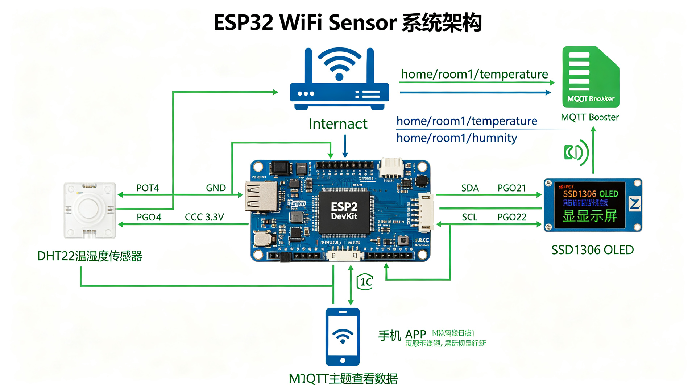

# ESP32 WiFi 温湿度传感器

ESP32 WiFi 温湿度传感器 + MQTT 上传 + OLED 显示示例。

## 功能特性

- DHT22 温湿度传感器读取（GPIO4）
- SSD1306 OLED 显示（I2C，GPIO21/22）
- WiFi 连接 + 自动重连
- MQTT 发布温湿度数据
- MQTT 订阅命令主题（支持远程重启）
- 每 5 秒采样一次

## 硬件要求

ESP32 DevKit + DHT22 + SSD1306 OLED

## 使用方法

Arduino IDE 打开 .ino 文件，安装依赖库（DHT、PubSubClient、Adafruit SSD1306、Adafruit GFX），修改 WiFi 和 MQTT 配置后上传。

## 接线说明

详见上方接线图/架构图。
