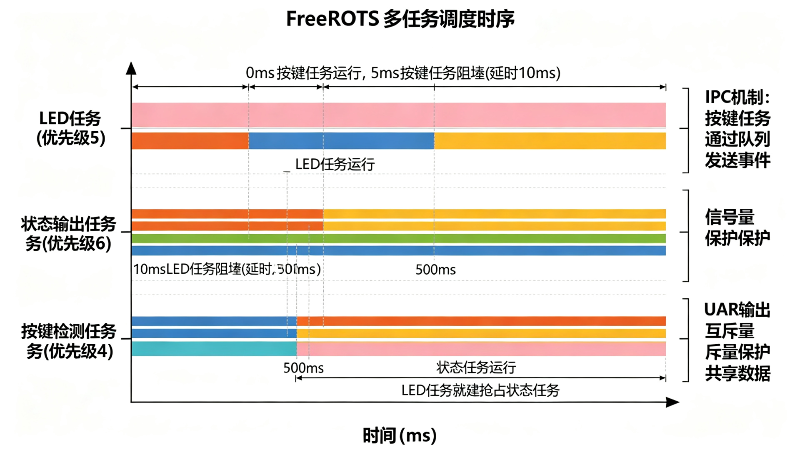

# FreeRTOS 多任务示例

FreeRTOS 多任务示例，演示任务创建、队列、信号量、互斥量的使用。

## 功能特性

- LED 任务（优先级 Normal，500ms 周期闪烁）
- 状态输出任务（优先级 BelowNormal，1s 周期输出系统状态）
- 按键检测任务（优先级 AboveNormal，10ms 扫描，消抖）
- 消息队列：按键事件传递
- 信号量：保护 UART 输出（二值信号量）
- 互斥量：保护共享数据（支持优先级继承）
- CMSIS_V2 API

## 硬件要求

STM32F407 + FreeRTOS（CubeMX 集成）

## 使用方法

CubeMX 启用 FREERTOS（CMSIS_V2），配置 LED(PC13)、KEY(PA0)、USART1，生成代码后替换 main.c。

## 接线说明

详见上方接线图/架构图。
