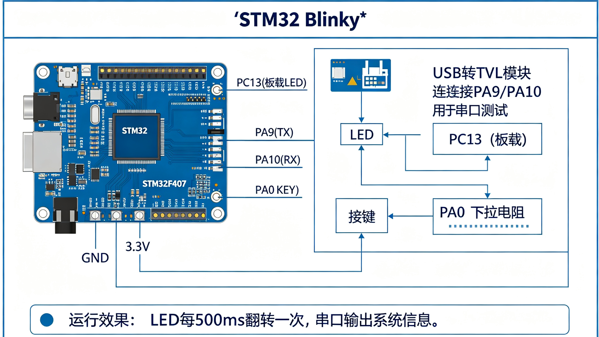

# STM32 Blinky 示例

STM32F407 LED 闪烁 + 串口输出 + 按键外部中断示例。

## 功能特性

- LED (PC13) 每 500ms 翻转一次
- USART1 (PA9/PA10) 115200 波特率串口输出
- 按键 (PA0) 外部中断，按下翻转 LED
- DWT 周期计数器实现微秒级延时
- 非阻塞定时（millis 风格）

## 硬件要求

STM32F407VGT6（可移植到其他 STM32 系列）

## 使用方法

用 STM32CubeMX 创建工程（配置 RCC、SYS、USART1、GPIO、EXTI），生成代码后替换 Src/main.c 和 Inc/main.h。

## 接线说明

详见上方接线图/架构图。
