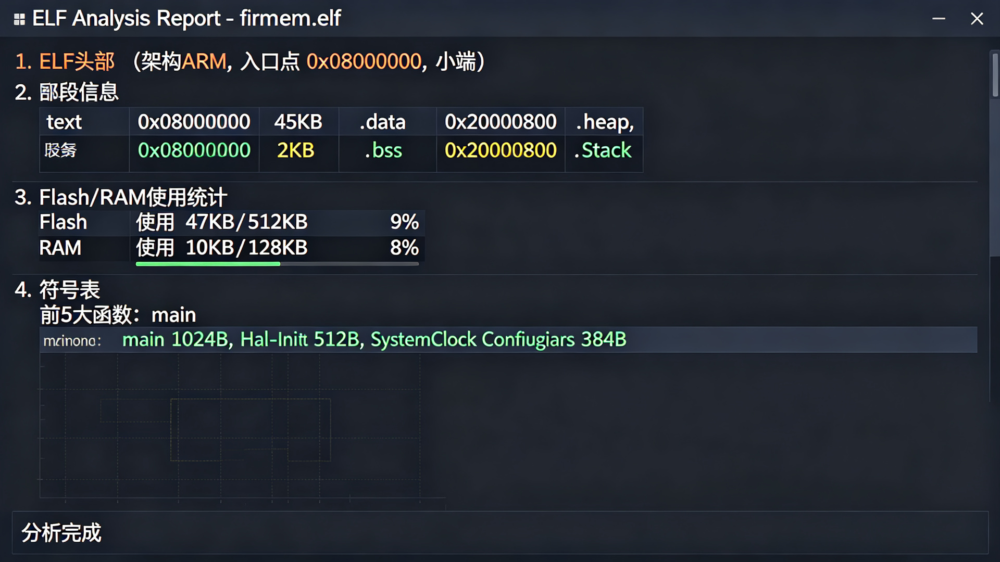

# ELF 固件分析工具 (ELF Analyzer)



一个用于分析嵌入式固件 ELF 文件的 Python 工具，提供段信息、符号表、Flash/RAM 使用统计、未使用符号查找、内存映射等功能。

## 功能特性

- ELF 头部信息（架构、入口点、字节序、ABI）
- 段（Section）信息和大小统计
- 程序头（Program Header）信息
- Flash / RAM 使用量估算
- 符号表（函数/变量，按大小排序）
- 未使用静态符号查找
- 内存映射概览（按地址区域分类）
- 生成完整分析报告到文件

## 依赖安装

```bash
pip install pyelftools
```

## 使用方法

```bash
# 基本信息（头部 + 段 + 内存映射）
python elf_analyzer.py firmware.elf

# 显示符号表
python elf_analyzer.py firmware.elf --symbols

# 查找未使用符号
python elf_analyzer.py firmware.elf --unused

# 显示所有信息
python elf_analyzer.py firmware.elf --all

# 生成完整报告
python elf_analyzer.py firmware.elf --report report.txt

# 符号大小过滤（只显示 >= 16 字节的符号）
python elf_analyzer.py firmware.elf --symbols --min-size 16
```

## 命令行参数

| 参数 | 说明 |
|------|------|
| `elf_file` | ELF 文件路径（必填） |
| `--header` | 显示 ELF 头部 |
| `--sections` | 显示段信息 |
| `--segments` | 显示程序头 |
| `--symbols` | 显示符号表 |
| `--unused` | 查找未使用符号 |
| `--memory` | 显示内存映射 |
| `--all` | 显示所有信息 |
| `--min-size N` | 符号最小大小过滤（字节） |
| `--report FILE` | 生成完整报告到文件 |

## 输出示例

```
=== ELF 头部信息 ===
  文件:           firmware.elf
  类别:           32位
  字节序:         小端 (Little Endian)
  架构:           EM_ARM
  入口点:         0x08000000

=== 段信息 ===
  .text           0x08000000  45,056 bytes
  .data           0x20000000   2,048 bytes
  .bss            0x20000800   8,192 bytes
  估算 Flash 使用: 47,104 bytes (46.0 KB)
  估算 RAM 使用:   10,240 bytes (10.0 KB)
```
