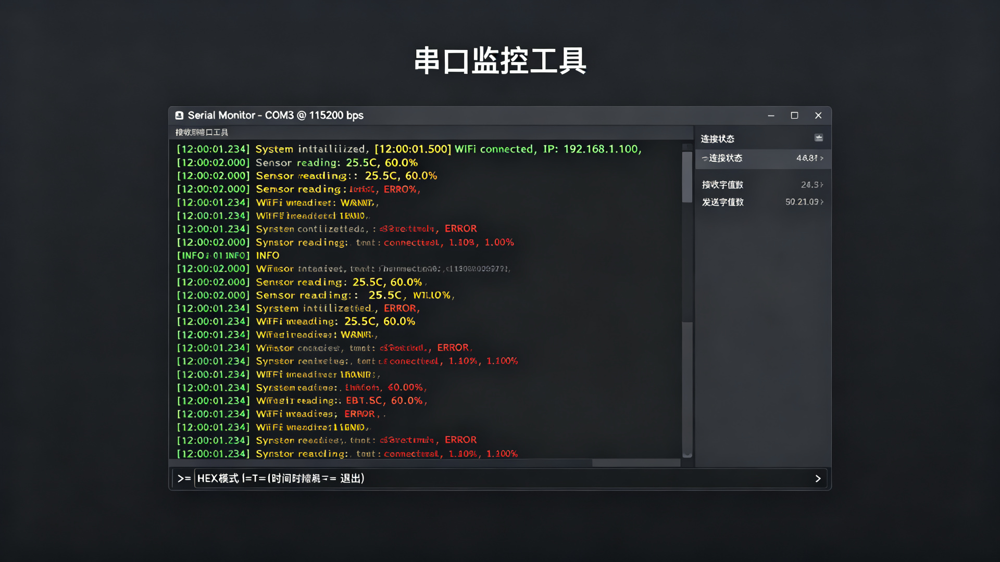

# 串口监控工具 (Serial Monitor)



一个功能完善的 Python 串口监控工具，支持 ASCII/HEX 显示切换、时间戳、日志保存、自动重连等功能。

## 功能特性

- 列出所有可用串口
- 实时显示接收数据（ASCII / HEX 模式切换）
- 时间戳显示（毫秒级精度）
- 发送数据（支持 ASCII 和 HEX 格式）
- 日志保存到文件
- 自动重连（设备断开后自动尝试重连）
- 运行时命令：`h` 切换 HEX、`t` 切换时间戳、`c` 清屏、`q` 退出

## 依赖安装

```bash
pip install pyserial
```

## 使用方法

```bash
# 列出可用串口
python serial_monitor.py --list

# 连接串口（默认 115200 波特率）
python serial_monitor.py -p COM3 -b 115200

# HEX 模式 + 日志保存
python serial_monitor.py -p /dev/ttyUSB0 -b 9600 --hex --log output.txt

# 禁用时间戳和自动重连
python serial_monitor.py -p COM3 -b 115200 --no-timestamp --no-reconnect
```

## 命令行参数

| 参数 | 说明 | 默认值 |
|------|------|--------|
| `-p, --port` | 串口名称 | 必填 |
| `-b, --baudrate` | 波特率 | 115200 |
| `--list` | 列出可用串口 | - |
| `--hex` | HEX 显示模式 | ASCII |
| `--no-timestamp` | 不显示时间戳 | 显示 |
| `--log` | 保存日志到文件 | - |
| `--no-reconnect` | 禁用自动重连 | 启用 |

## 运行时命令

在程序运行中输入以下命令：

- `h` - 切换 HEX/ASCII 显示模式
- `t` - 切换时间戳显示
- `c` - 清屏
- `q` - 退出程序
- 其他输入 - 作为数据发送到串口（HEX 格式如 `AA BB CC` 或 `0xAABBCC`）
